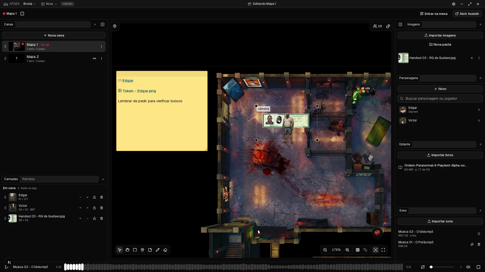
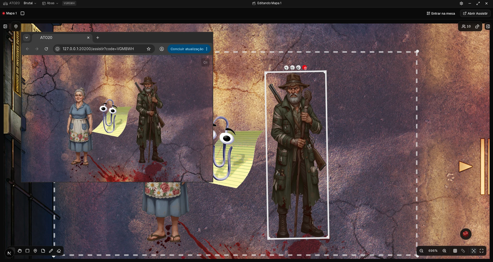
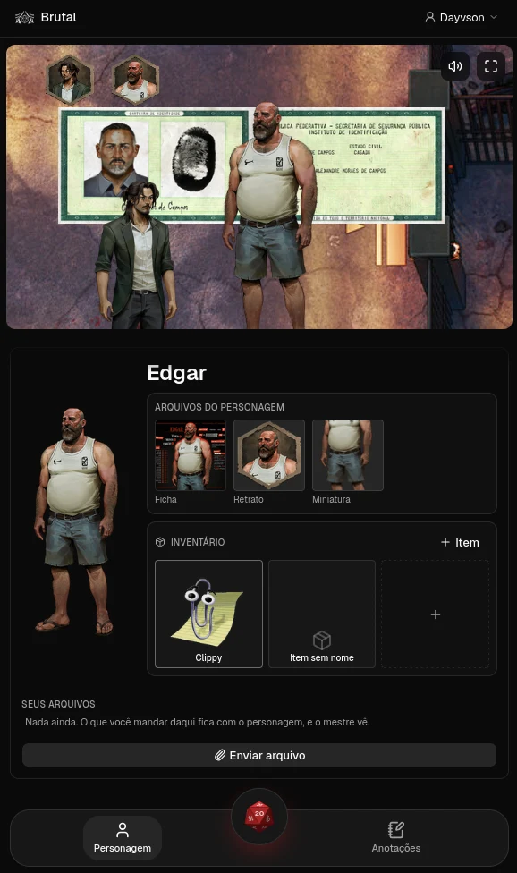

# ATO20

**A sua IDE para RPG de mesa.**

Este repositório é a **landing page**. O aplicativo mora em [`ato20`](https://github.com/ato20-org/ato20).

---

## O que é o ATO20

Ferramenta para desenvolver suas histórias e controlar suas cenas de RPG de mesa. Feita para
mesas **presenciais ou em LAN**: o mestre monta a próxima cena no notebook enquanto a mesa
continua vendo a atual na TV, e cada jogador acompanha pelo próprio celular.

Aplicativo de desktop. Sem servidor, sem conta, sem login — uma campanha é uma pasta no seu
disco, e quem serve as telas dos jogadores é um daemon que roda dentro do próprio aplicativo,
na rede local.

**Open source e gratuito** — uma contribuição para a comunidade de RPG.

## Três telas

### Operador

A tela do mestre, dentro do aplicativo: monta cenas, arrasta imagens, esconde regiões e
decide o que entra no ar. A cena **em edição** e a cena **no ar** são separadas — é isso que
permite preparar a próxima enquanto a mesa segue na atual.

### Assistir

Só o palco, sem controle. Vai na TV atrás do mestre, aberta no navegador de qualquer aparelho
da casa. Abaixo ela aparece sobre o Operador, que é como se confere o enquadramento: o que o
mestre move de um lado a mesa vê do outro, dez vezes por segundo.

### Plateia

O celular de cada jogador: o palco em cima, e embaixo o personagem dele — ficha, retrato,
inventário, anotações e os arquivos que ele mesmo anexa. Entra lendo o QR do Operador, e
ninguém instala nada além do mestre.

  

## Licença

[MIT](LICENSE). Use, modifique e distribua.
